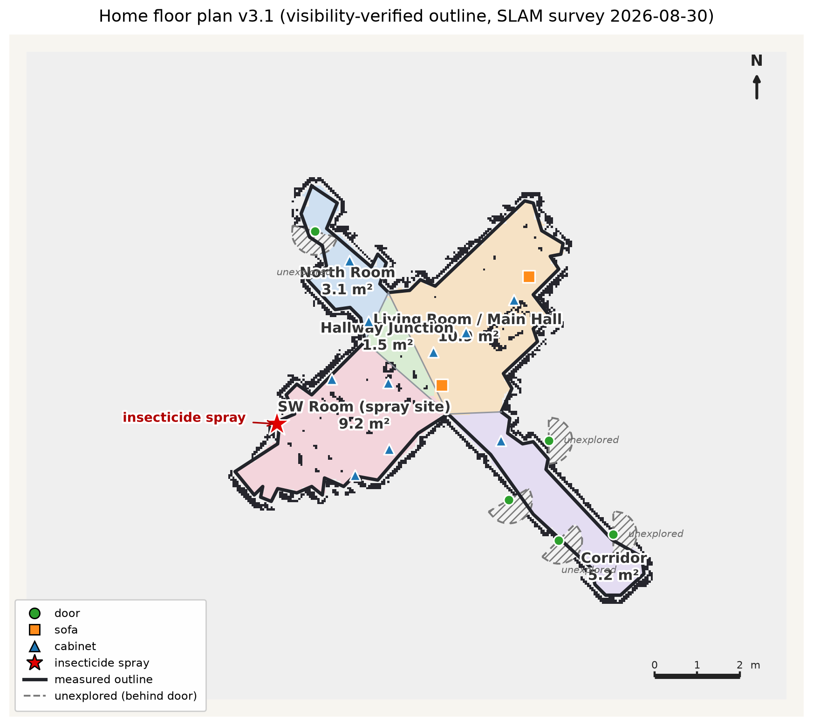

# semantic-slam-car

An indoor **semantic mapping robot** built on a Waveshare JetBot Pro (Jetson Nano, ROS1 Melodic).
One supervised tele-operated survey run produces:

1. a 2D occupancy-grid map (gmapping), recorded together with a synchronized
   stereo-camera / LiDAR / odometry / TF rosbag ("one-pass capture");
2. offline open-vocabulary object detection (LLMDet / GroundingDINO — no
   task-specific training) on the recorded stereo frames;
3. stereo disparity depth + SLAM TF projection, placing detected points of
   interest (doors, sofas, cabinets, vending machines, ...) onto the map;
4. room segmentation (Voronoi-based) and an optional labeled floor-plan
   rendering pipeline (`floorplan/`).

The motivation: mainstream navigation apps do not work inside buildings because
providers cannot obtain effective, up-to-date indoor data. A small robot that any
student can run (with the building owner's approval) can build a
building-specific semantic map instead.

```text
one supervised survey pass
  └─ gmapping + stereo video + LiDAR + odom + TF
        └─ final occupancy map + atomically committed rosbag
              └─ offline open-vocabulary detection (PC)
                    └─ offline stereo depth + TF projection
                          └─ labeled semantic map (PNG + YAML)
                                └─ room segmentation → floor plan
```

## Final result

The end-to-end output of the pipeline — one supervised survey pass of a real
apartment, turned into a labeled architectural floor plan (room segmentation,
areas, doors/furniture POIs from open-vocabulary detection, unexplored regions
marked):



The corresponding rosbag and occupancy maps are not distributed (see below);
this rendering is published deliberately as the project's final artifact.

## Repository layout

| Path | What it is |
|---|---|
| `overlay/jetbot_pro/` | **Original files written for this project** that sit on top of the upstream [waveshare/jetbot_pro](https://github.com/waveshare/jetbot_pro) package: semantic mapper, stereo calibration pipeline, capture/replay contracts, safety node, launch files, unit tests |
| `overlay/gscam/` | Original addition to [ros-drivers/gscam](https://github.com/ros-drivers/gscam): a raw-image side-channel copy node used by the capture pipeline (+ test) |
| `patches/` | `git diff` patches with the local modifications made to the two upstream packages (parameter tuning, EKF odometry fixes, moving hard-coded vendor API keys into environment variables, robustness fixes in `jetbot.cpp` / `gscam.cpp`) |
| `tools/` | Offline PC-side pipeline: bag analysis, stereo timestamp checks, detection, semantic-layer merging, POI de-duplication, room segmentation (incl. a Voronoi implementation and an evaluation against the Bormann room-segmentation benchmark), map-identity manifests, glass keep-out map builder |
| `tests/` | PC-side pytest suites for the offline pipeline (artifact contracts, map identity, rosbag index compatibility, room-segmentation boundaries, detection post-processing) |
| `floorplan/` | Occupancy grid → labeled architectural floor plan. Geometry is fully deterministic; an LLM is optionally used **only** to propose room names and cannot alter any coordinate |
| `deploy/` | Field scripts actually used on the robot: atomic survey capture with preflight checks, AMCL diagnostics, teleop restart, disk/status probes, release manifests |
| `docs/` | Technical run-books (in Chinese): end-to-end demo guide, IMX219-83 stereo migration notes and calibration guide |

## Why patches instead of a full source tree

The upstream `jetbot_pro` package does not declare an open-source license, so its
code is not redistributed here. This repository contains only (a) files written
for this project and (b) diffs against the pinned upstream commits. Run
`./setup_workspace.sh` to assemble a complete `catkin_ws/src`:

```bash
./setup_workspace.sh ~/catkin_ws/src
```

It clones the two upstream repos at the pinned commits, applies the patches, and
copies the overlay files on top.

Pinned upstream commits:

- `waveshare/jetbot_pro` @ `b76d483fbd5ceb41a66be4945ed2fc712b5d36a4`
- `ros-drivers/gscam` @ `1b0b8e51b91522edadd8399d4ad920f8afbc487d` (BSD)

## What is intentionally *not* in this repository

- Recorded rosbags and the raw occupancy maps (they were surveyed in a private
  home; both privacy-sensitive and far too large for git). The single rendered
  floor plan above is the only surveyed artifact published, by choice.
- Model weights (see `tools/requirements-offline.txt` and the detection scripts
  for how to fetch them).
- API credentials of any kind. All external services are read from environment
  variables; nothing in this tree contains a key.

## Testing

```bash
# PC-side offline pipeline tests
python -m pytest tests/

# package-level tests (after setup_workspace.sh, inside the assembled package)
python -m pytest overlay/jetbot_pro/tests/
```

## Development notes

Built and iterated over several months as a personal project. AI coding
assistants were used during development (pair-programming and code review);
every change that reached the robot went through the preflight/contract checks
in `deploy/` and the test suites above, and field failures were diagnosed and
fixed by hand. The docs in `docs/` are the run-books actually used during
surveys.

## License

Original code in this repository (everything outside `patches/`) is released
under the MIT License (see `LICENSE`). The patches remain subject to the terms
of their respective upstream projects — see `THIRD_PARTY.md`.
